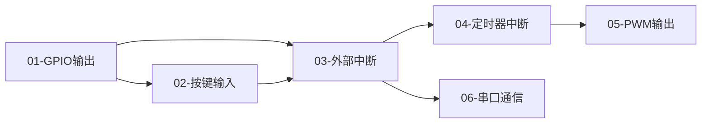

# STM32F103C8T6 标准库学习笔记

> 基于 **江协科技 STM32 标准库系列课程** 的动手实验归档
> 板型：**STM32F103C8T6**（Blue Pill 最小系统板）
> 目标：**27届应届硕士研究生秋招复习与作品集**

---

## 📊 学习进度

| # | 章节 | 核心内容 | 状态 |
|---|------|---------|:----:|
| 01 | [GPIO输出—点亮LED](./01-GPIO-Output-LED/README.md) | GPIO 推挽输出、RCC 时钟使能、高低电平控制 | ✅ |
| 02 | 待添加 | | ⬜ |
| 03 | 待添加 | | ⬜ |

<!-- 每完成一节更新此行，保持进度表可见 -->

---

## 🧭 知识图谱

> 下面是各章节之间的知识点连接关系，复习时可以沿着箭头串联。



<!-- 随着章节增加持续更新此图 -->

---

## 📁 仓库结构

```
.
├── README.md                         ← 总览（进度表 + 知识图谱）
├── AGENTS.md                         ← 文档生成约定
├── _Template/                        ← 章节模板
│   └── chapter-template.md
├── 01-GPIO-Output-LED/               ← 示例章节
│   ├── README.md
│   ├── Code/
│   ├── Hardware/
│   └── Results/
└── ...                               ← 后续章节依次递增
```

---

## 🎯 秋招复习指引

### 按章节复习

从上方的进度表点击章节号，进入对应实验报告。每份报告包含：
- 硬件连接图与接线表
- 带逐段解析的核心代码
- 提炼的关键知识点（标注面试易问项）
- 实际踩坑与解决过程（面试高频素材）

### 技能树覆盖

| 技能方向 | 覆盖章节 | 秋招价值 |
|---------|---------|:-------:|
| GPIO 输入输出 | 01, 02 | ⭐⭐⭐ |
| 中断系统 | 03, 04 | ⭐⭐⭐⭐⭐ |
| 定时器 | 04, 05 | ⭐⭐⭐⭐⭐ |
| 通信协议 | 06, 09, 10 | ⭐⭐⭐⭐⭐ |
| DMA | 08 | ⭐⭐⭐⭐ |
| ADC | 07 | ⭐⭐⭐ |

<!-- 后续随学习进度更新 -->

---

> 🚀 **持续更新中** — 每完成一节课程，这里就会多一章记录
